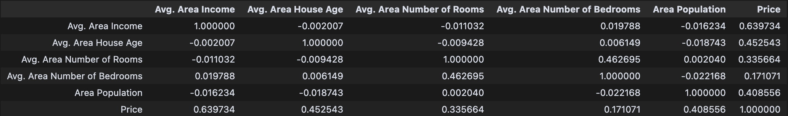
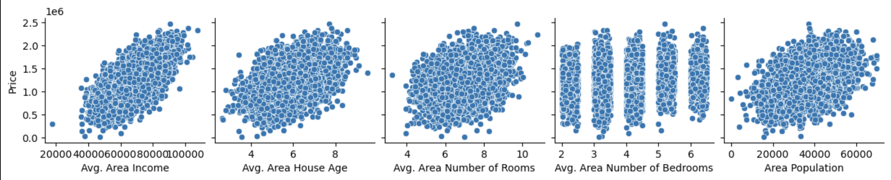

# US Housing Price Prediction Model

## Introduction

Given a fabricated dataset containing information about U.S. homes, I sought to develop a model that could **predict the estimated purchase price** of a home using several input features:

- Average Area Income
- House Age
- Number of Rooms
- Number of Bedrooms
- Area Population

The dataset included a long-form text column "Address", which was excluded due to standardization difficulties and redundancy. I assumed that **average area income** would already capture most location-based variation in price.

---

## Exploratory Data Analysis (EDA)

We examined the relationships between the target variable (`Price`) and predictors using:

- Summary statistics
- Correlation matrix
- Visualizations (scatterplots, pairwise comparisons)

### Key Findings:

- **Avg. Area Income** had the strongest positive correlation with `Price` (see Figure 2).
- **Avg. Area House Age** and **Area Population** showed moderate correlation.
- **Avg. Area Number of Bedrooms** showed **no meaningful correlation** and was dropped (see Figures 1 & 2).
- Scatterplots revealed mostly linear relationships, no major skew or outliers, and no null values.

_Figure 1 - DataFrame Feature Correlation Table_

_Figure 2 - Pairwise Relationships of Features_

---

## Initial Modeling

We applied and compared the following regression models:

- **Linear Regression**
- **Random Forest Regression**
- **Decision Tree Regression**

The dataset was split into:

- **70% Training Set**
- **30% Testing Set**

### Initial Features:

- Avg. Area Income
- Avg. Area House Age
- Avg. Area Number of Rooms
- Avg. Area Number of Bedrooms
- Area Population

---

## Feature Selection

I used **p-values, R-values**, and **R² contributions** to evaluate feature relevance.

- **Avg. Area Number of Bedrooms** had low predictive value and was removed due to:
  - Low correlation (Figure 1 & 2)
  - High p-value
  - Minimal R² contribution

---

## 📈 Model Evaluation

The **Multiple Linear Regression model** emerged as the best performer:

### Linear Regression Metrics:

- **Mean Absolute Error (MAE):** $81,116.43
- **Mean Squared Error (MSE):** 10,062,092,569.3
- **Root Mean Squared Error (RMSE):** 100,309.98
- **Explained Variance Score:** 0.96
- **R² Score:** 0.91
- **Score:** 0.9147

### Feature Significance:

- **P-Values:** Values < 0.05 confirmed statistical relevance
- **Coefficients:** Showed how each unit change in a feature impacts Price

---

## ✅ Conclusion

I successfully developed a **Multiple Linear Regression** model capable of explaining **96% of the variance in U.S. house prices** using only a handful of features:

- Avg. Area Income
- Avg. Area House Age
- Avg. Area Number of Rooms
- Area Population

The model is interpretable, statistically sound, and avoids overfitting.

### 📌 Next Steps:

- Incorporate additional features like **square footage**, **garden**, or **pool**
- Test performance on real-world datasets
- Deploy model for use in **investment decision-making**

---

> _This project demonstrates that simple, well-selected features can drive strong predictive models, even in complex markets like real estate._
